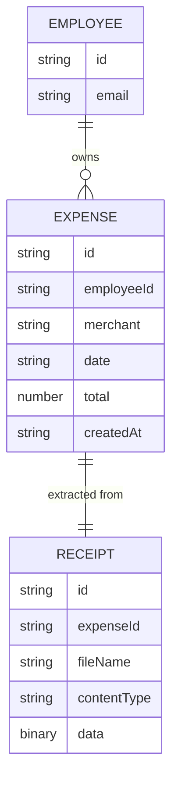

# Domain Model

The system tracks each employee's own expenses, each backed by the receipt it was extracted from.

- **Employee** is the signed-in caller, identified by the Thunder-issued subject; the id is never chosen by the client.
- **Expense** is one saved, final record — merchant, date and total as the employee confirmed them. It is never edited or deleted after saving.
- **Receipt** is the original uploaded photo or PDF, kept alongside its Expense so the employee can view it later.

