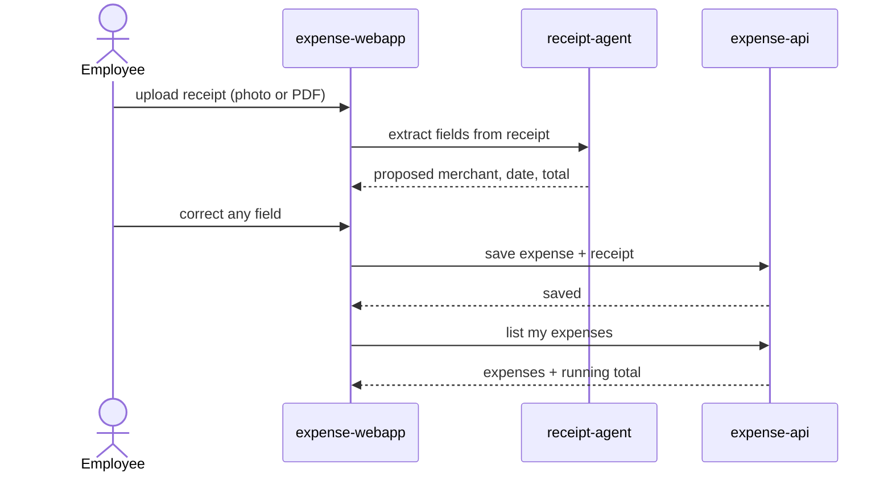

# Log an expense

An employee uploads a receipt, has its fields auto-extracted, corrects them, and saves the expense.

```mermaid
sequenceDiagram
    actor Employee
    participant expense-webapp
    participant receipt-agent
    participant expense-api

    Employee->>expense-webapp: upload receipt (photo or PDF)
    expense-webapp->>receipt-agent: extract fields from receipt
    receipt-agent-->>expense-webapp: proposed merchant, date, total
    Employee->>expense-webapp: correct any field
    expense-webapp->>expense-api: save expense + receipt
    expense-api-->>expense-webapp: saved
    expense-webapp->>expense-api: list my expenses
    expense-api-->>expense-webapp: expenses + running total
```

